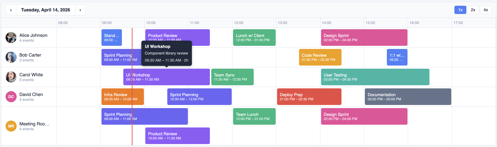

# @widgetkit/scheduler-react

A fast, accessible timeline scheduler component for React. Supports drag-and-drop, resize, multi-row layouts, zoom, and full keyboard navigation — with zero dependencies beyond React itself.



## Installation

```bash
npm install @widgetkit/scheduler-react
# or
pnpm add @widgetkit/scheduler-react
# or
yarn add @widgetkit/scheduler-react
```

## Usage

Import the component and its stylesheet, then pass resources and items:

```tsx
import { TimelineScheduler } from "@widgetkit/scheduler-react";
import "@widgetkit/scheduler-react/styles.css";

const resources = [
  { id: "alice", name: "Alice" },
  { id: "bob", name: "Bob" },
];

const items = [
  {
    id: "1",
    resourceId: "alice",
    name: "Team meeting",
    color: "#6366f1",
    start: new Date("2024-06-10T09:00"),
    end: new Date("2024-06-10T10:30"),
  },
];

export default function App() {
  const [date, setDate] = useState(new Date());
  const [currentItems, setItems] = useState(items);

  return (
    <TimelineScheduler
      resources={resources}
      items={currentItems}
      date={date}
      draggable
      resizable
      creatable
      onItemsChange={setItems}
      onDateChange={setDate}
    />
  );
}
```

### Custom item renderer

```tsx
<TimelineScheduler
  resources={resources}
  items={items}
  date={date}
  renderItem={(item) => <span style={{ fontWeight: "bold" }}>{item.name}</span>}
/>
```

---

## Props

### Data

| Prop        | Type             | Required | Description                                 |
| ----------- | ---------------- | -------- | ------------------------------------------- |
| `resources` | `Resource[]`     | Yes      | Rows in the scheduler. See [types](#types). |
| `items`     | `TimelineItem[]` | Yes      | Events to display. See [types](#types).     |
| `date`      | `Date`           | Yes      | The day currently shown.                    |

### Time range

| Prop          | Type     | Default | Description                           |
| ------------- | -------- | ------- | ------------------------------------- |
| `startHour`   | `number` | `0`     | First visible hour (0–23).            |
| `endHour`     | `number` | `24`    | Last visible hour (1–24).             |
| `snapMinutes` | `number` | `15`    | Snap interval when dragging/creating. |

### Interaction

| Prop                 | Type      | Default | Description                                                            |
| -------------------- | --------- | ------- | ---------------------------------------------------------------------- |
| `draggable`          | `boolean` | `true`  | Allow items to be dragged to a new time or resource.                   |
| `resizable`          | `boolean` | `false` | Allow items to be resized by dragging their edges.                     |
| `creatable`          | `boolean` | `false` | Allow new items to be created by clicking and holding on an empty row. |
| `editable`           | `boolean` | `true`  | Show an edit modal on double-click.                                    |
| `readonly`           | `boolean` | `false` | Disable all interactions. Overrides all of the above.                  |
| `minDurationMinutes` | `number`  | `0`     | Minimum item duration in minutes. `0` means no limit.                  |
| `maxDurationMinutes` | `number`  | `0`     | Maximum item duration in minutes. `0` means no limit.                  |

### Display

| Prop               | Type          | Default | Description                                                 |
| ------------------ | ------------- | ------- | ----------------------------------------------------------- |
| `zoom`             | `1 \| 2 \| 4` | `1`     | Horizontal zoom level. `2` = double width, `4` = quadruple. |
| `showNav`          | `boolean`     | `false` | Show previous/next day buttons.                             |
| `showDateNav`      | `boolean`     | `true`  | Show the date header with navigation.                       |
| `showZoomControls` | `boolean`     | `true`  | Show zoom in/out buttons.                                   |
| `showTime`         | `boolean`     | `true`  | Show start and end time on each item.                       |
| `showAvatar`       | `boolean`     | `true`  | Show resource avatar in the row header.                     |
| `showEventCount`   | `boolean`     | `true`  | Show the number of events per resource.                     |
| `showTooltip`      | `boolean`     | `true`  | Show a tooltip with item details on hover.                  |
| `showNowLine`      | `boolean`     | `true`  | Show a line indicating the current time.                    |

### Custom renderer

| Prop         | Type                                | Description                                              |
| ------------ | ----------------------------------- | -------------------------------------------------------- |
| `renderItem` | `(item: TimelineItem) => ReactNode` | Replace the default item content with a custom renderer. |

---

## Events

| Prop                | Signature                                 | Description                                                                    |
| ------------------- | ----------------------------------------- | ------------------------------------------------------------------------------ |
| `onItemsChange`     | `(items: TimelineItem[]) => void`         | Fired after a drag or resize completes. Receives the full updated items array. |
| `onDateChange`      | `(date: Date) => void`                    | Fired when the user navigates to a different day.                              |
| `onZoomChange`      | `(zoom: 1 \| 2 \| 4) => void`             | Fired when the zoom level changes.                                             |
| `onItemCreate`      | `(detail: ItemCreateDetail) => void`      | Fired when a new item is created via click-and-hold.                           |
| `onItemClick`       | `(detail: ItemClickDetail) => void`       | Fired on single click.                                                         |
| `onItemDblClick`    | `(detail: ItemDblClickDetail) => void`    | Fired on double-click.                                                         |
| `onItemHover`       | `(detail: ItemHoverDetail) => void`       | Fired on pointer enter/leave.                                                  |
| `onItemContextMenu` | `(detail: ItemContextMenuDetail) => void` | Fired on right-click.                                                          |
| `onItemDragStart`   | `(detail: ItemDragStartDetail) => void`   | Fired when a drag begins.                                                      |
| `onItemDragEnd`     | `(detail: ItemDragEndDetail) => void`     | Fired when a drag ends.                                                        |
| `onItemResizeStart` | `(detail: ItemResizeStartDetail) => void` | Fired when a resize begins.                                                    |
| `onItemResizeEnd`   | `(detail: ItemResizeEndDetail) => void`   | Fired when a resize ends.                                                      |

---

## Types

```ts
interface Resource {
  id: string;
  name: string;
  avatar?: string; // URL to an image shown in the row header
}

interface TimelineItem {
  id: string;
  resourceId: string; // Must match a Resource id
  name: string;
  color: string; // CSS color string
  start: Date;
  end: Date;
  description?: string;
}
```
